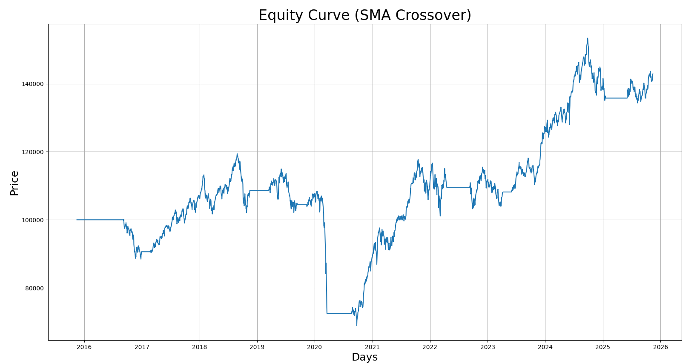

---

# 📈 Algorithmic Trading Backtester

A modular, extensible **algorithmic trading backtesting framework** built in Python.
This project allows you to load historical OHLC data, run trading strategies such as **SMA / EMA crossovers**, generate **equity curves**, and evaluate performance using industry-standard metrics like **CAGR, Sharpe Ratio, Volatility, and Max Drawdown**.

Designed to be simple enough for learning — yet structured like a real-world backtesting engine used in quant finance.

---

## 🚀 Features

* Modular project structure (indicators → strategies → backtester → metrics → plots)
* SMA & EMA crossover strategies
* Computes key performance metrics:

  * **CAGR (Compounded Annual Growth Rate)**
  * **Sharpe Ratio**
  * **Maximum Drawdown**
  * **Volatility**
  
* Clear equity curve visualization
* Works with any OHLCV-style CSV
* Easily extendable to add:

  * New indicators
  * New strategies
  * Slippage, fees, risk models

---

## 📂 Project Structure

```
BACKTEST/
│── backtesting/
│   ├── backtester.py
│   ├── metrics.py
│
│── data/
│   ├── nifty50_one_year.csv
│   ├── nifty50_ten_year.csv
│
│── indicators/
│   ├── sma.py
│   ├── ema.py
│
│── strategies/
│   ├── sma_crossover.py
│   ├── ema_crossover.py
│
│── utils/
│   ├── data_loader.py
│   ├── plot.py
│
│── main.py
│── requirements.txt
│── .gitignore
```

---

## 🔍 How It Works

### 1. Load Data

CSV data is parsed, cleaned, and converted into a Pandas DataFrame:

* Dates converted to datetime
* Prices parsed to floats
* Sorted in chronological order

### 2. Generate Indicators

Example: 50-day and 200-day SMA/EMA created from close prices.

### 3. Strategy Produces Signals

Each strategy outputs a signal series:

* `1` → Buy
* `-1` → Sell
* `0` → Hold

### 4. Backtester Simulates Trades

The backtester performs:

* Position sizing (simple “full buy” model)
* Equity curve tracking
* Cash vs. position state management

### 5. Metrics Are Computed

Using the equity curve, the framework computes:

* **CAGR** – long-term annual growth
* **Sharpe Ratio** – risk-adjusted returns
* **Max Drawdown** – worst portfolio fall
* **Volatility** – fluctuation of returns

### 6. Plots Are Generated

Equity curves and indicators are visualized using Matplotlib.

---

## 📦 Main Requirements

* **pandas** – data handling
* **numpy** – numerical operations
* **matplotlib** – plotting

---

## 📉 Example Output Plots

```markdown
### Equity Curve – EMA Crossover


### Equity Curve – SMA Crossover

```

---

## 📌 Future Improvements

* Add RSI strategy
* Add Bollinger Bands strategy
* Add Sortino Ratio
* Add transaction costs
* Add portfolio equity curve chart
* Add parameter optimization (grid search)

---

## 🤝 Contributions

Contributions are welcome!
You can help by:

* Adding new indicators
* Implementing new strategies
* Improving visualizations
* Adding new financial metrics
* Refactoring or optimizing backtester logic

Submit a PR or open an issue — feedback and collaboration are appreciated.

---


